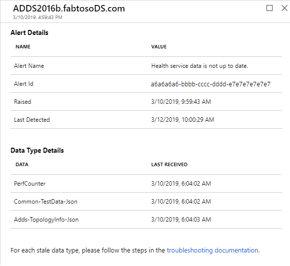

# Health service data isn't up to date alert

## Overview

The agents on the on-premises machines that Microsoft Entra Connect Health monitors periodically upload data to the Microsoft Entra Connect Health Service. If the service doesn't receive data from an agent, the information the portal presents will be stale. To highlight the issue, the service raises the **Health service data isn't up to date** alert. This alert is generated when the service hasn't received complete data in the past two hours.  

- The **Warning** status alert fires if the Health Service received only **partial** data types sent from the server in the past two hours. The warning status alert doesn't trigger email notifications to configured recipients. 
- The **Error** status alert fires if the Health Service hasn't received any data types from the server in the past two hours. The error status alert triggers email notifications to configured recipients.

The service gets the data from agents that are running on the on-premises machines, depending on the service type. The following table lists the agents that run on the machine, what they do, and the data types that the service generates. In some cases, there are multiple services involved in the process, so any of them could be the culprit. 

## Understanding the alert

The **Alert Details** blade shows when the alert occurred and was last detected. A background process that runs every two hours generates and re-evaluates the alert. In the following example, the initial alert occurred on 03/10 at 9:59 AM. The alert still existed on 03/12 at 10:00 AM when the alert was evaluated again. The blade also details the time the Health Service last received a particular data type. 
 
 
 
The following table maps service types to corresponding required data types:

| Service type | Agent (Windows Service name) | Purpose | Data type generated  |
| --- | --- | --- | --- |  
| Microsoft Entra Connect (Sync) | Microsoft Entra Connect Health Sync Insights Service | Collect Microsoft Entra Connect-specific information (connectors, synchronization rules, and so on) | - AadSyncService-SynchronizationRules    - AadSyncService-Connectors   - AadSyncService-GlobalConfigurations     - AadSyncService-RunProfileResults   - AadSyncService-ServiceConfigurations   - AadSyncService-ServiceStatus   |
|  | Microsoft Entra Connect Health Sync Monitoring Service | Collect Microsoft Entra Connect-specific perf counters, ETW traces, files | Performance counter |
| AD DS | Microsoft Entra Connect Health AD DS Insights Service | Perform synthetic tests, collect topology information, replication metadata |  - Adds-TopologyInfo-Json   - Common-TestData-Json (creates the test results)   | 
|  | Microsoft Entra Connect Health AD DS Monitoring Service | Collect ADDS-specific perf counters, ETW traces, files | - Performance counter    - Common-TestData-Json (uploads the test results)  |
| AD FS | Microsoft Entra Connect Health Agent | Perform synthetic tests | TestResult (creates the test results) | 
| | Microsoft Entra Connect Health Agent  | Collect ADFS usage metrics | Adfs-UsageMetrics |
| | Microsoft Entra Connect Health Agent | Collect ADFS-specific perf counters, ETW traces, files | TestResult (uploads the test results) |

## Troubleshooting steps 

The steps required to diagnose the issue is given below. The first is a set of basic checks that are common to all Service Types. 

> [!IMPORTANT] 
> This alert follows Connect Health [data retention policy](reference-connect-health-user-privacy.md#data-retention-policy)

* Make sure the latest versions of the agents are installed. View [release history](reference-connect-health-version-history.md). 
* Make sure that Microsoft Entra Connect Health Agents services are **running** on the machine. For example, Connect Health for AD FS should have two services.
  

* Make sure to go over and meet the [requirements section](how-to-connect-health-agent-install.md#requirements).
* Use [test connectivity tool](how-to-connect-health-agent-install.md#test-connectivity-to-azure-ad-connect-health-service) to discover connectivity issues.
* If you have an HTTP Proxy, follow these [configuration steps](how-to-connect-health-agent-install.md#configure-azure-ad-connect-health-agents-to-use-http-proxy). 

## Next steps
If any of the above steps identified an issue, fix it and wait for the alert to resolve. The alert background process runs every 2 hours, so it can take up to 2 hours to resolve the alert. 

* [Microsoft Entra Connect Health data retention policy](reference-connect-health-user-privacy.md#data-retention-policy)
* [Microsoft Entra Connect Health FAQ](reference-connect-health-faq.yml)
