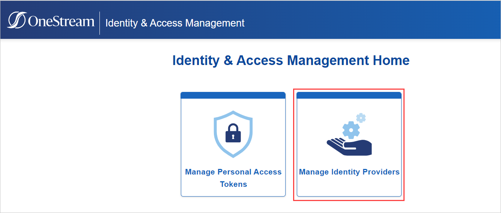
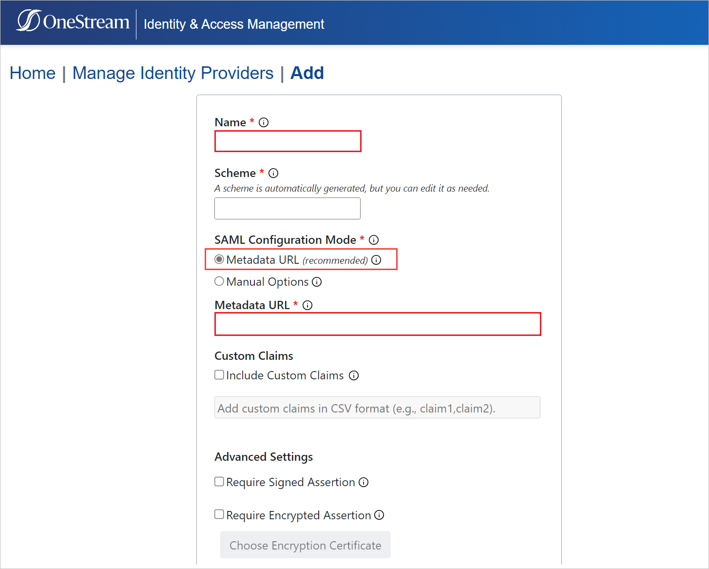
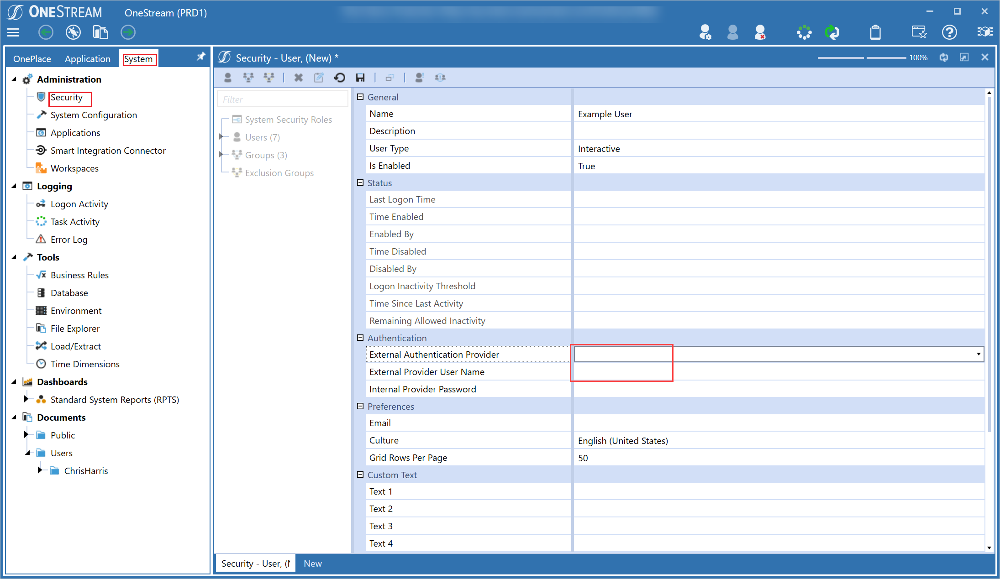

# Microsoft Entra SSO integration with OneStream

In this article,  you learn how to integrate OneStream with Microsoft Entra ID. When you integrate OneStream with Microsoft Entra ID, you can:

* Control in Microsoft Entra ID who has access to OneStream.
* Enable your users to be automatically signed-in to OneStream with their Microsoft Entra accounts.
* Manage your accounts in one central location.

## Prerequisites

The scenario outlined in this article assumes that you already have the following prerequisites:
[!INCLUDE [common-prerequisites.md](~/identity/saas-apps/includes/common-prerequisites.md)]
* OneStream single sign-on (SSO) enabled subscription.

## Scenario description

In this article,  you configure and test Microsoft Entra SSO in a test environment.

* OneStream supports only **SP** initiated SSO.

## Add OneStream from the gallery

To configure the integration of OneStream into Microsoft Entra ID, you need to add OneStream from the gallery to your list of managed SaaS apps.

1. Sign in to the [Microsoft Entra admin center](https://entra.microsoft.com) as at least a [Cloud Application Administrator](~/identity/role-based-access-control/permissions-reference.md#cloud-application-administrator).
1. Browse to **Entra ID** > **Enterprise apps** > **New application**.
1. In the **Add from the gallery** section, type **OneStream** in the search box.
1. Select **OneStream** from results panel and then add the app. Wait a few seconds while the app is added to your tenant.

[!INCLUDE [sso-wizard.md](~/identity/saas-apps/includes/sso-wizard.md)]

## Configure and test Microsoft Entra SSO for OneStream

Configure and test Microsoft Entra SSO with OneStream using a test user called **B.Simon**. For SSO to work, you need to establish a link relationship between a Microsoft Entra user and the related user in OneStream.

To configure and test Microsoft Entra SSO with OneStream, perform the following steps:

1. **[Configure Microsoft Entra SSO](#configure-microsoft-entra-sso)** - to enable your users to use this feature.
    1. **Create a Microsoft Entra test user** - to test Microsoft Entra single sign-on with B.Simon.
    1. **Create a Microsoft Entra test user** - to enable B.Simon to use Microsoft Entra single sign-on.
1. **[Configure OneStream SSO](#configure-onestream-sso)** - to configure the single sign-on settings on application side.
    1. **[Create OneStream test user](#create-onestream-test-user)** - to have a counterpart of B.Simon in OneStream that's linked to the Microsoft Entra ID representation of user.
1. **[Test SSO](#test-sso)** - to verify whether the configuration works.

## Configure Microsoft Entra SSO

Follow these steps to enable Microsoft Entra SSO in the Microsoft Entra admin center.

1. Sign in to the [Microsoft Entra admin center](https://entra.microsoft.com) as at least a [Cloud Application Administrator](~/identity/role-based-access-control/permissions-reference.md#cloud-application-administrator).
1. Browse to **Entra ID** > **Enterprise apps** > **OneStream** > **Single sign-on**.
1. On the **Select a single sign-on method** page, select **SAML**.
1. On the **Set up single sign-on with SAML** page, select the pencil icon for **Basic SAML Configuration** to edit the settings.

   

1. On the **Basic SAML Configuration** section, perform the following steps:

    a. In the **Identifier (Entity ID)** text box, type a URL using the following pattern:
    `https://<CustomerDomain>.onestreamcloud.com/OneStreamIS/federation/<Scheme>/saml`

    b. In the **Reply URL** text box, type a URL using the following pattern:
    `https://<CustomerDomain>.onestreamcloud.com/OneStreamIS/federation/<Scheme>/signin-saml`

    c. In the **Sign on URL** text box, type a URL using the following pattern:
    `https://<CustomerDomain>.onestreamcloud.com/OneStreamIS/federation/<Scheme>/signin-saml`

	> [!NOTE]
	> These values aren't real. Update these values with the actual Identifier, Reply URL and Sign on URL. Create a new SAML provider in the **OneStream Identity and Access Management Portal** to obtain these values which is explained later in [Configure OneStream SSO](#configure-onestream-sso) section. You can also refer to the patterns shown in the **Basic SAML Configuration** section in the Microsoft Entra admin center.

1. OneStream application expects the SAML assertions in a specific format, which requires you to add custom attribute mappings to your SAML token attributes configuration. The following screenshot shows the list of default attributes.

	

1. In addition to above, OneStream application expects few more attributes to be passed back in SAML response which are shown below. These attributes are also pre populated but you can review them as per your requirements.
	
	| Name | Source Attribute|
	| -----| --------------- |
	| firstname | user.givenname |
	| lastname| user.surname |
	| email | user.mail |

1. On the **Set up single sign-on with SAML** page, in the **SAML Signing Certificate** section, select copy button to copy **App Federation Metadata Url** and save it on your computer.

	

[!INCLUDE [create-assign-users-sso.md](~/identity/saas-apps/includes/create-assign-users-sso.md)]

## Configure OneStream SSO

1. Log in to OneStream company site as an administrator.

1. Go to **Identity and Access Management** and select **Manage Identity Providers** tile.

    

1. On the **Manage Identity Providers** page, select **+Add SAML Provider**.

    

1. Perform the following steps in the below page:

    

    1. Enter a unique name of your identity provider in the **Name** textbox.

    1. Select **Metadata URL** as SAML Configuration Mode.

    1. In the **Metadata URL** textbox, paste the **App Federation Metadata Url**, which you have copied from Microsoft Entra admin center.

    1. Select **SAVE** button.

> [!NOTE]
> Please refer [OneStream Documentation Site](https://docs.onestream.com/) under **System Guides** > **Identity and Access Management** for more details.

### Create OneStream test user

1. In a different web browser window, sign in to your OneStream company site as an administrator.

1. Go to **System** > **Security** > select **Create User** and perform the following steps:

    

    1. Enter a valid username in the **Name** field.

    1. Enter **User Type** based on your requirements.

    1. Select **External Authentication Provider** from the drop-down.

    1. Enter the Microsoft Entra ID **User principal name** in the **External Provider User Name** field.

> [!NOTE]
> Please refer [OneStream Documentation Site](https://docs.onestream.com/) and navigate to **Design and Reference** > **About Managing Users and Groups** > **Creating and Managing Users** for more information.

## Test SSO 

In this section, you test your Microsoft Entra single sign-on configuration with following options.
 
* Select **Test this application** in Microsoft Entra admin center. this option redirects to OneStream Sign-on URL where you can initiate the login flow.
 
* Go to OneStream Sign-on URL directly and initiate the login flow from there.

## Related content

Once you configure OneStream you can enforce session control, which protects exfiltration and infiltration of your organization's sensitive data in real time. Session control extends from Conditional Access. [Learn how to enforce session control with Microsoft Defender for Cloud Apps](/cloud-app-security/proxy-deployment-any-app).