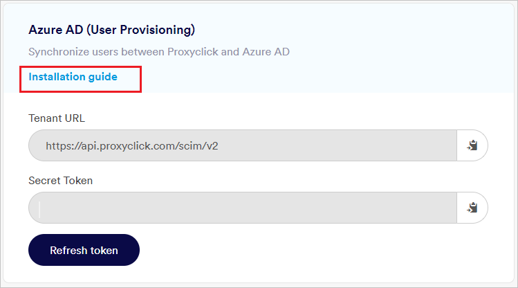
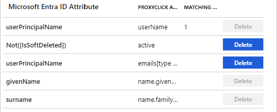

# Configure Proxyclick for automatic user provisioning

The objective of this article is to demonstrate the steps to be performed in Proxyclick and Microsoft Entra ID to configure Microsoft Entra ID to automatically provision and de-provision users and/or groups to Proxyclick.

> [!NOTE]
> This article describes a connector built on top of the Microsoft Entra user provisioning service. For important details on what this service does, how it works, and frequently asked questions, see [Automate user provisioning and deprovisioning to SaaS applications with Microsoft Entra ID](~/identity/app-provisioning/user-provisioning.md).
>

## Prerequisites

The scenario outlined in this article assumes that you already have the following prerequisites:

[!INCLUDE [common-prerequisites.md](~/identity/saas-apps/includes/common-prerequisites.md)]
* [A Proxyclick tenant](https://www.proxyclick.com/pricing)
* A user account in Proxyclick with Admin permissions.

## Add Proxyclick from the gallery

Before configuring Proxyclick for automatic user provisioning with Microsoft Entra ID, you need to add Proxyclick from the Microsoft Entra application gallery to your list of managed SaaS applications.

**To add Proxyclick from the Microsoft Entra application gallery, perform the following steps:**

1. Sign in to the [Microsoft Entra admin center](https://entra.microsoft.com) as at least a [Cloud Application Administrator](~/identity/role-based-access-control/permissions-reference.md#cloud-application-administrator).
1. Browse to **Entra ID** > **Enterprise apps** > **New application**.
1. In the **Add from the gallery** section, type **Proxyclick**, select **Proxyclick** in the search box.
1. Select **Proxyclick** from results panel and then add the app. Wait a few seconds while the app is added to your tenant.
	

## Assigning users to Proxyclick

Microsoft Entra ID uses a concept called *assignments* to determine which users should receive access to selected apps. In the context of automatic user provisioning, only the users and/or groups that have been assigned to an application in Microsoft Entra ID are synchronized.

Before configuring and enabling automatic user provisioning, you should decide which users and/or groups in Microsoft Entra ID need access to Proxyclick. Once decided, you can assign these users and/or groups to Proxyclick by following the instructions here:

* [Assign a user or group to an enterprise app](~/identity/enterprise-apps/assign-user-or-group-access-portal.md)

### Important tips for assigning users to Proxyclick

* It's recommended that a single Microsoft Entra user is assigned to Proxyclick to test the automatic user provisioning configuration. Additional users and/or groups may be assigned later.

* When assigning a user to Proxyclick, you must select any valid application-specific role (if available) in the assignment dialog. Users with the **Default Access** role are excluded from provisioning.

## Configuring automatic user provisioning to Proxyclick 

This section guides you through the steps to configure the Microsoft Entra provisioning service to create, update, and disable users and/or groups in Proxyclick based on user and/or group assignments in Microsoft Entra ID.

> [!TIP]
> You may also choose to enable SAML-based single sign-on for Proxyclick, following the instructions provided in the [Proxyclick single sign-on  article](proxyclick-tutorial.md). Single sign-on can be configured independently of automatic user provisioning, though these two features complement each other.

### To configure automatic user provisioning for Proxyclick in Microsoft Entra ID:

1. Sign in to the [Microsoft Entra admin center](https://entra.microsoft.com) as at least a [Cloud Application Administrator](~/identity/role-based-access-control/permissions-reference.md#cloud-application-administrator).
1. Browse to **Entra ID** > **Enterprise apps**

	

1. In the applications list, select **Proxyclick**.

	

3. Select the **Provisioning** tab.

	

4. Set the **Provisioning Mode** to **Automatic**.

	

5. To retrieve the **Tenant URL** and **Secret Token** of your Proxyclick account, follow the walkthrough as described in Step 6.

6. Sign in to your [Proxyclick Admin Console](https://app.proxyclick.com/login//?destination=%2Fdefault). Navigate to **Settings** > **Integrations** > **Browse Marketplace**.

	

	

	

	Select **Microsoft Entra ID**. Select **Install now**.

	

	

	Select **User Provisioning** and select **Start integration**. 

	

	The appropriate settings configuration UI should now show up under **Settings** > **Integrations**. Select **Settings** under **Microsoft Entra ID (User Provisioning)**.

	

	You can find the **Tenant URL** and **Secret Token** here.

	

7. Upon populating the fields shown in Step 5, select **Test Connection** to ensure Microsoft Entra ID can connect to Proxyclick. If the connection fails, ensure your Proxyclick account has Admin permissions and try again.

	

8. In the **Notification Email** field, enter the email address of a person or group who should receive the provisioning error notifications and check the checkbox - **Send an email notification when a failure occurs**.

	

9. Select **Save**.

10. Under the **Mappings** section, select **Synchronize Microsoft Entra users to Proxyclick**.

11. Review the user attributes that are synchronized from Microsoft Entra ID to Proxyclick in the **Attribute Mapping** section. The attributes selected as **Matching** properties are used to match the user accounts in Proxyclick for update operations. Select the **Save** button to commit any changes.

    

13. To configure scoping filters, refer to the following instructions provided in the [Scoping filter  article](~/identity/app-provisioning/define-conditional-rules-for-provisioning-user-accounts.md).

14. To enable the Microsoft Entra provisioning service for Proxyclick, change the **Provisioning Status** to **On** in the **Settings** section.

	

15. Define the users and/or groups that you would like to provision to Proxyclick by choosing the desired values in **Scope** in the **Settings** section.

	

16. When you're ready to provision, select **Save**.

	

This operation starts the initial synchronization of all users and/or groups defined in **Scope** in the **Settings** section. The initial sync takes longer to perform than subsequent syncs, which occur approximately every 40 minutes as long as the Microsoft Entra provisioning service is running. You can use the **Synchronization Details** section to monitor progress and follow links to provisioning activity report, which describes all actions performed by the Microsoft Entra provisioning service on Proxyclick.

For more information on how to read the Microsoft Entra provisioning logs, see [Reporting on automatic user account provisioning](~/identity/app-provisioning/check-status-user-account-provisioning.md).

## Connector Limitations

* Proxyclick requires **emails** and **userName** to have the same source value. Any updates to either attributes will modify the other value.
* Proxyclick doesn't support provisioning for groups.

## Additional resources

* [Managing user account provisioning for Enterprise Apps](~/identity/app-provisioning/configure-automatic-user-provisioning-portal.md)
* [What is application access and single sign-on with Microsoft Entra ID?](~/identity/enterprise-apps/what-is-single-sign-on.md)

## Related content

* [Learn how to review logs and get reports on provisioning activity](~/identity/app-provisioning/check-status-user-account-provisioning.md)
